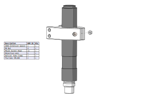
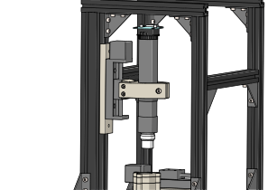

# Schistoscope Assembly Maunal
## Assembly Manual

## Disclaimer

## Introduction

>The Schistoscope is a low-cost, portable microscope designed to be used in the field for the detection of schistosomiasis. This version of the Schistoscope is designed to be used with a Raspberry Pi, and is capable of imaging schistosome eggs in urine samples.

## Table of Contents

### 3D Printing Setup and Laser Cutting

### Frame Assembly

### Electronics Assembly

### X-Y Stage Assembly

### Optical Tube Assembly

### Z Stage Assembly

### Light Source Assembly

### Software Installation

### Wiring Diagram

### Enclosure Assembly

### Usage and Troubleshooting
***
-----

## 3D Printing and Setup and Laser Cutting
The scope has the following 3D printed parts:
1. Sample Stage Holder
2. Sample Stage
3. Y Gantry Base
4. Z Gantry Base
5. Y Endstop 1
6. Y Endstop 2
7. X Endstop 1
8. X Endstop 2
9.  Z Endstop 1
10. Z Endstop 2
11. Optical Tube Clamp
12. Z Lead Screw Mount
13. LED Base
14. Condesor Lens Mount 1
15. Illumination Body
16. Condensor Lens Mount 2
17. IO Plate
> It is recommeded to print the parts with the following settings:
>> 1. Layer Height: 0.2mm
>> 2. Infill: 20%
>> 3. Supports: Not Required
>> 4. Material: PETG

# Preparing the 3D Printed Parts
Some parts require additional preparation before assembly. The following parts require additional preparation:
1. Sample Stage Holder:  
Insert the M3 heat set insert into the holes (refer image) on the top of the sample stage holder. The insert should be flush with the top of the sample stage holder.  
   
1. Y Gantry Base  
Insert the M3 heat set insert into the holes (refer image) on the top of the part. The insert should be flush with the top of the part.  
   
2. Z Gantry Base  
Insert the M3 heat set insert into the holes (refer image) on the top of the part. The insert should be flush with the top of the part.  
   
3. Y Endstop 1 and Y Endstop 2
Insert the M2 heat set insert into the hole (refer image) on the top of the part. The insert should be flush with the top of the part.  
   
1. X Endstop 1 and X Endstop 2  
Insert the M2 heat set insert into the hole (refer image) on the top of the part. The insert should be flush with the top of the part.  
   
2. Z Endstop 1 and Z Endstop 2  
Insert the M2 heat set insert into the hole (refer image) on the top of the part. The insert should be flush with the top of the part.  
   
3. Z Lead Screw Mount  
Insert the M3 heat set insert into the hole (refer image) on the top of the part. The insert should be flush with the top of the part.  
   

----
The scope has the following laser cut parts:
1. Side Panel 1
2. Side Panel 2
3. Back Panel
4. Bottom Panel
5. Top Panel
6. Front Panel
7. Door
8. Light Source Base
9. Electronics Base

_____
_____

# Frame Assembly
The frame of the scope is made from 2020 (20x20mm) and 2040 (20x40mm) aluminium extrusions. The frame is secured using right angle brackets with M4x6mm screws and T-nuts.  

| Sr No. | Part | Qty |
| --- | --- | --- |
| 1 | Right Angle Bracket | 16 |
| 2 | M4x6mm Socket Head Screw | 64 |
| 3 | M4 T-nut | 64 |

The alumnum extrusion is cut to the following lengths:
###### 2020 Extrusion

| Sr No. | Length | Qty |
| --- | --- | --- |
| 1 | 350mm | 2 |
| 2 | 175mm | 2 |
| 3 | 205mm | 2 |
| 4 | 215mm | 2 |
| 5 | 300mm | 3 |

###### 2040 Extrusion

| Sr No. | Length | Qty |
| --- | --- | --- |
| 1 | 300mm | 1 |
  
The frame is assembled as follows:
1. Assemble the 2020 extrusions as shown in the image below. Hover over the table on the left to the see location of the profiles in the image on the right and vicevera.  

2. Fasten the bottom panel to the frame using M4x8mm screws (the length is depends on the your laser cut thickness) and T-nuts. 
Make sure the panel is flush with the back of the frame.  

1. Place the longest motor slide on the bottom panel as shown in the image below. Make sure the motor is at the back side. Fasten the slide to the panel using four M4 screws and hex nuts.  

1. Place the Y Gantry Base on the slide as shown in the image below. Fasten the base to the slide using four M3 screws.  

1. Place the smaller motor slide on the 3D printed part as shown in the image below. Make sure the motor is at the left side. Fasten the slide to the panel using four M4 screws.  

1. Assemble the Light Tower as shown in the image below. Just insert the M3 screws do not fasten the parts together.  

1. Place the Light Tower on the lasercut part as shown in the image below. Fasten the 3D printed parts to the panel with hex nuts and the panel using four M4 screws and T nuts.

1. Place the Z Gantry Base on the 2040 profile. Fasten the base to the profile using two M4 screws and T nuts. Then place remaining small motor slide on the base as shown in the image below. Fasten the slide to the panel using four M4 screws.  

1. Place and fasten with four M3 bolts the Z Lead Screw Mount slide as shown in the image below.  

1. Place the Thorlabs CML100 tube in the optical tube clamp as shown in the image below. Lightly fasten the tube to the clamp using one M4.  

1. Add the 50mm Extension tube to the optical tube clamp as shown in the image below.  

1. Add the objedtive lens to the tube clamp as shown in the image below.  

1. Add the Raspberry Pi Camera to the tibe top as shown in the image below.  

1. Attach the optical tube clamp to the Z Lead Screw Mount as shown in the image below. Use 4 M3 screws to fasten the clamp to the mount.  

1. Assemble the sample stage as shown in the images below.  

1. Mount the sample stage assembly on the Y Gantry Base as shown in the image below. Use 4 M3 screws to fasten them together. (The image is shown from the rear of the scope)  

1. The scope should look something like this.  

1. Mount the limit switch to the Z end stops as shown in the image below. Use 2 M2 screws to fasten them together.  
Note: the limit switch is mounted on the opposite side of the 3D printed part when mounted on the scope.  

1. Make sure that the distance between the limit switches is equal to 50mm. Try to align them to the edges of the motor slide as shown in the image below.  

